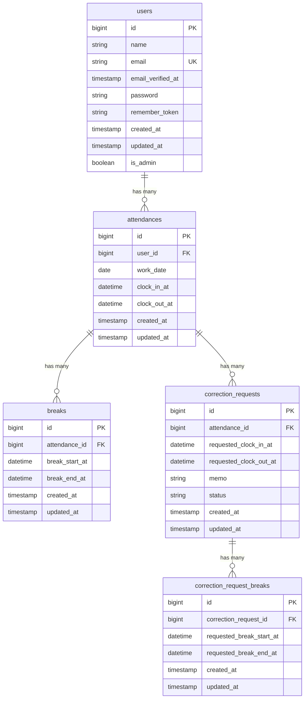

# COACHTECH 模擬案件 勤怠管理アプリ

勤怠、休憩の登録や修正依頼ができます。
全員の勤務状況一覧および個人の勤務詳細も確認できます。
また管理者アカウントでは修正の承認や編集なども可能です。

## 作成者

志賀 由美子

## 使用技術

- ○○○○○ NN.NN
- ○○○○○ NN.NN
- ○○○○○ NN.NN
- ○○○○○ NN.NN
- ○○○○○ NN.NN

## ER図



### 設計上の補足

- attendancesは、user_idとwork_dateの組み合わせにUNIQUE制約を設定する。
- 勤怠と修正申請の1対多は、申請履歴を複数保存する場合の設計案。

### 未確定事項

- 修正申請・申請用休憩の希望時刻のNULL可否
- 勤怠がない日の申請の保存方法と、clock_in_atのNULL可否
- 再申請時の履歴の扱い
- 承認時の休憩データの更新方法

## 開発環境URL

http://localhost

## 動作環境

Docker Desktopを使用したDocker環境で動作します。
Laravel Sailを使用してLaravel、MySQLなどの開発環境を構築しています。
フロントエンドにはViteおよびTailwind CSSを使用しています。

## 環境構築手順

1. **リポジトリをクローン**

```bash
$ git clone <https://○○○○○○>
```

1. **.envファイルの準備**

    ○○○○○○ ○○○○○○ ○○○○○○ ○○○○○○ ○○○○○○
    ○○○○○○ ○○○○○○ ○○○○○○ ○○○○○○ ○○○○○○

2. **Composer依存パッケージのインストール**

```bash
$ docker run --rm \
  -u "$(id -u):$(id -g)" \
  -v "$(pwd):/var/www/html" \
  -w /var/www/html \
  -e COMPOSER_CACHE_DIR=/tmp/composer_cache \
  laravelsail/php82-composer:latest \
  composer install --ignore-platform-reqs
```

1. **Laravel Sailの起動**

    ○○○○○○ ○○○○○○ ○○○○○○ ○○○○○○ ○○○○○○
    ○○○○○○ ○○○○○○ ○○○○○○ ○○○○○○ ○○○○○○

2. **アプリケーションキーの生成**

    ○○○○○○ ○○○○○○ ○○○○○○ ○○○○○○ ○○○○○○
    ○○○○○○ ○○○○○○ ○○○○○○ ○○○○○○ ○○○○○○

3. **データベースのマイグレーションと初期データ投入**

    ○○○○○○ ○○○○○○ ○○○○○○ ○○○○○○ ○○○○○○
    ○○○○○○ ○○○○○○ ○○○○○○ ○○○○○○ ○○○○○○

4. **フロントエンドのビルド**

    ○○○○○○ ○○○○○○ ○○○○○○ ○○○○○○ ○○○○○○
    ○○○○○○ ○○○○○○ ○○○○○○ ○○○○○○ ○○○○○○

5. **アプリケーションへのアクセス**

    ○○○○○○ ○○○○○○ ○○○○○○ ○○○○○○ ○○○○○○
    ○○○○○○ ○○○○○○ ○○○○○○ ○○○○○○ ○○○○○○

## テスト実行

```
○○○○○○ ○○○○○○ ○○○○○○ ○○○○○○ ○○○○○○
○○○○○○ ○○○○○○ ○○○○○○ ○○○○○○ ○○○○○○
```

## 機能一覧

- ○○○○○○ ○○○○○○
- ○○○○○○ ○○○○○○
- ○○○○○○ ○○○○○○
- ○○○○○○ ○○○○○○
- ○○○○○○ ○○○○○○
- ○○○○○○ ○○○○○○

## APIエンドポイント一覧

○○○○○○ ○○○○○○ ○○○○○○ ○○○○○○ ○○○○○○ ○○○○○○ ○○○○○○ ○○○○○○ ○○○○○○

| HTTPメソッド | URI                   | 概要   |
| ------------ | --------------------- | ------ |
| GET          | /○○○○○○/○○○○○○/○○○○○○ | ○○○○○○ |
| GET          | /○○○○○○/○○○○○○/○○○○○○ | ○○○○○○ |
| GET          | /○○○○○○/○○○○○○/○○○○○○ | ○○○○○○ |
| GET          | /○○○○○○/○○○○○○/○○○○○○ | ○○○○○○ |
| GET          | /○○○○○○/○○○○○○/○○○○○○ | ○○○○○○ |

#
